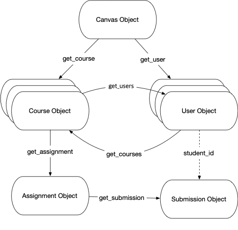

<!-- _class: lead -->
<!-- _class: frontpage -->
<!-- _paginate: skip -->

# Getting Started with CanvasAPI

<https://canvasapi.readthedocs.io/en/stable/getting-started.html>

---

## canvasutils/canvasutils.py

- get_environment()

```python
def get_environment():
  if not os.path.exists('.env'):
      return {}
  
  load_dotenv()
  
  required_vars = ['API_KEY', 'API_URL']
  missing_vars = []
  
  for var in required_vars:
      value = os.getenv(var)
      if not value:
          missing_vars.append(var)
  
  if missing_vars:
      for var in missing_vars:
          print(f"   - {var}")
      return {}

  return {'API_KEY': os.getenv('API_KEY'), 'API_URL': os.getenv('API_URL')}
```

---

- get_canvas()

Initialize and return a Canvas instance if environment is valid.

```python
def get_canvas():
    env = get_environment()
    if not env:
        return None
    return Canvas(env["API_URL"], env["API_KEY"])
```

---

## Objects



---

```python
# Canvas object
canvas = Canvas(API_URL, API_KEY)

# Course object
course = canvas.get_course(123456)
course.name
course.update(course={'name': 'New Course Name'})

# User object
user = canvas.get_user(123)
login_id_user = canvas.get_user('some_user', 'sis_login_id')

user.name
courses = user.get_courses()
```

---

### Warning: PaginatedList

PaginatedList lazily loads its elements. Unfortunately, there’s no way to determine the exact number of records Canvas will return without traversing the list fully.

```python
courses = user.get_courses()
print(courses) => <PaginatedList of type Course> # This is an issue
for course in courses:
    print(course)
```

We need to force iteration so the library actually makes all API calls

```python
courses = list(user.get_courses())
print(len(courses))
```

---

## DateTimes

We can use Python's datetime in canvasapi

```python
from datetime import datetime

start_date = datetime(2018, 1, 1, 0, 1)  # '2018-01-01T00:01Z'
end_date = datetime(2018, 12, 31, 11, 59)  # '2018-12-31T11:59Z'
course.update(
    course={
        'start_at': start_date,
        'end_at': end_date,
    }
)
```

---

If Canvas returns an ISO 8601 formatted datetime string, CanvasAPI will automatically create a datetime object from that string.

```python
course = canvas.get_course(1)
course.start_at # '2014-02-11T16:38:00Z'
course.start_at_date # datetime.datetime(2014, 2, 11, 16, 38, tzinfo=<UTC>)
```

---

## User Object

### Type

```python
users = course.get_users()

# Get all students
for user in users:
    print(user)

# Get only students
users = course.get_users(enrollment_type=['student'])

# Get teachers, tas, and designers
type_list = ['teacher', 'ta', 'designer']
users = course.get_users(enrollment_type=type_list)
```

---

### State

```python
users = course.get_users(
    enrollment_type=['teacher', 'student']
    enrollment_state=['active', 'invited']
)
```

---

## Assignments

Get all or ungraded assignments.

```python
assignments = course.get_assignments()
assignments = course.get_assignments(bucket='ungraded')
```

---

Create a new assignment.

```python
new_assignment = course.create_assignment({
    'name': 'Assignment 1'
})
new_assignment = course.create_assignment({
    'name': 'Assignment 2',
    'submission_types': ['online_upload', 'online_text_entry', 'online_url']
})
new_assignment = course.create_assignment({
    'name': 'Assignment 3',
    'submission_types': ['online_upload'],
    'allowed_extensions': ['docx', 'doc', 'pdf'],
    'notify_of_update': True,
    'points_possible': 100,
    'due_at': datetime(2018, 12, 31, 11, 59),
    'description': 'Please upload your homework as a Word document or PDF.',
    'published': True
})
```

---

### Submission

```python
submission = assignment.get_submission(student_id)
submission.edit(submission={'posted_grade':score})
```

### Example: Add n Points to All Users' Assignment

```python

added_points = 2

submissions = assignment.get_submissions()
for submission in submissions:
    if submission.score is not None:
        score = submission.score + added_points
    else:
        score = 0 + added_points
    submission.edit(submission={'posted_grade': score})
```

---

## Programming Techniques

---

### Keyword Arguments

```python
course.get_users(search_term='John Doe')
course.get_users(
    search_term='John Doe',
    enrollment_role='StudentEnrollment'
)
```

---

### List Parameters

```python
course.get_users(enrollment_type=['teacher', 'student'])
course.get_users(
    enrollment_type=['teacher', 'student'],
    search_term='John',
    include=['email']
)
```

---

### Nested Parameeters

Think of it as the JSON dictionary.

```python
account.create_course(course={'name': 'Example Course'})

# pass the course[name], 
# course[course_code], 
# and course[is_public] arguments
account.create_course(
    course={
        'name': 'Example Course',
        'course_code': 'TST1234',
        'is_public': True
    }
)
```

---

### Exceptions

```python
from canvasapi.exceptions import CanvasException

try:
    canvas.get_course(1)
except CanvasException as e:
    print(e)
```

---

### Debugging

- When you set a level on a handler or logger, it **filters out any messages below that level**.
  - For example, if the level is set to `INFO`, then `DEBUG` messages are ignored.
- The logger passes log messages to handlers only if the message level is >= logger’s level and handler’s level.
- Set the level according to the level of detail and seriousness of messages you want to see or store.
- For less noise, use higher levels; for detailed diagnostics, use lower levels like DEBUG.

---

<style scoped>
table { font-size: 20pt !important; line-height: 1.2 !important;}
</style>

| Level    | Numeric Value | Description                              | Strength (Severity)          |
|----------|---------------|------------------------------------------|------------------------------|
| DEBUG    | 10            | Detailed debugging information           | Weakest (lowest severity)    |
| INFO     | 20            | Normal operational messages              | Medium-low                   |
| WARNING  | 30            | Indications of possible problems         | Medium                       |
| ERROR    | 40            | Errors preventing functions from running | Strong                       |
| CRITICAL | 50            | Very serious errors, program may crash   | Strongest (highest severity) |

---

### Logging Example

```python
import logging
import sys

logger = logging.getLogger("canvasapi")
handler = logging.StreamHandler(sys.stdout)
formatter = logging.Formatter(
  '%(asctime)s - %(name)s - %(levelname)s - %(message)s')

handler.setLevel(logging.DEBUG)
handler.setFormatter(formatter)
logger.addHandler(handler)
logger.setLevel(logging.DEBUG)
```

---

#### Step 1: Create/Get a logger

```python
logger = logging.getLogger("canvasapi")
```

- Gets a named logger called "canvasapi".
- If the canvasapi package internally logs messages, this logger will capture them.
- If it doesn’t exist yet, Python creates it.

---

#### Step 2: Create a stream handler

```python
handler = logging.StreamHandler(sys.stdout)
```

- A handler decides where logs go.
- StreamHandler(sys.stdout) means logs will be printed to the console (standard output).

```python
# File handler
file_handler = logging.FileHandler("canvasapi.log", mode="w")  # "a" for append
```

- To print out results in a file, we use FileHandler.

---

#### Step 3: Define the log format

```python
formatter = logging.Formatter('%(asctime)s - %(name)s - %(levelname)s - %(message)s')
```

- %(asctime)s → the timestamp
- %(name)s → the logger name (here: "canvasapi")
- %(levelname)s → severity (DEBUG, INFO, WARNING, etc.)
- %(message)s → the actual log message

Example output:

```txt
2025-08-18 21:00:00,123 - canvasapi - DEBUG - GET request to /api/v1/courses
```

---

#### Step 4: Configure the handler

```python
handler.setLevel(logging.DEBUG)
handler.setFormatter(formatter)
```

- The handler will only emit messages at DEBUG level or higher.
- Messages will follow the formatter style.

---

#### Step 5: Attach handler to logger

```python
logger.addHandler(handler)
```

- Connects the handler (console output) to the canvasapi logger.

#### Step 6: Set logger’s level

```python
logger.setLevel(logging.DEBUG)
```

- Ensures the logger captures DEBUG and above messages.
- Without this, the default level (WARNING) would filter out lower-level messages.

---

```bash
# A previously configured `Canvas` client
>>> canvas.get_current_user()
2019-07-08 14:22:24,517 - canvasapi.requester - INFO - Request: GET https://base/api/v1/users/self
2019-07-08 14:22:24,517 - canvasapi.requester - DEBUG - Headers: {'Authorization': '****4BSt'}
2019-07-08 14:22:24,748 - canvasapi.requester - INFO - Response: GET https://base/api/v1/users/self 200
2019-07-08 14:22:24,749 - canvasapi.requester - DEBUG - Headers: {'Cache-Control': 'max-age=0, private, must-revalidate',
'Connection': 'keep-alive',
'Content-Encoding': 'gzip',
'Content-Length': '329',
'Content-Type': 'application/json; charset=utf-8',
2019-07-08 14:22:24,749 - canvasapi.requester - DEBUG - Data: {'avatar_url': 'https://base/images/thumbnails/43244/Umo5dyAg0OS3tpDtDN',
'created_at': '2014-08-22T08:02:00-04:00',
'effective_locale': 'en',
'email': '',
'id': XXXX181,
'integration_id': None,
'locale': None,
'login_id': 'XXXXXXXX181',
'name': 'Some User',
'permissions': {'can_update_avatar': True, 'can_update_name': False},
'root_account': 'xxxxxx.edu',
'short_name': 'Some User',
'sis_user_id': 'XXXXXXXX181',
'sortable_name': 'User S'}
```

---

### basicConfig

- For simple cases, just call `logging.basicConfig()` once at the start of your script:
- We add `handlers=[logging.FileHandler('debug.log')]` to print the log info in the "debug.log" file.

```python
import logging

logging.basicConfig(
  level=logging.DEBUG,
  format='%(asctime)s - %(name)s - %(levelname)s - %(message)s',
  handlers=[logging.FileHandler('logfile.log'), logging.StreamHandler(sys.stdout)]
)
logger = logging.getLogger(__name__)
```

---

### Configure the basicConfig

To see only your own info messages without verbose debug logs from Canvas API internals, set their logger level higher.

```python
logging.basicConfig(level=logging.DEBUG)

# Show DEBUG for your code
logger = logging.getLogger(__name__)
logger.setLevel(logging.DEBUG)

# Suppress verbose messages from canvasapi.requester
logging.getLogger('canvasapi.requester').setLevel(logging.WARNING)
```

---

### Filtering the Logging Information

You can add a filter to the logger or handler to allow only messages containing specific keywords or from specific modules.

```python
class MyFilter(logging.Filter):
    def filter(self, record):
        # Show only messages containing 'User ID'
        return 'User ID' in record.getMessage()

handler.addFilter(MyFilter())
```
