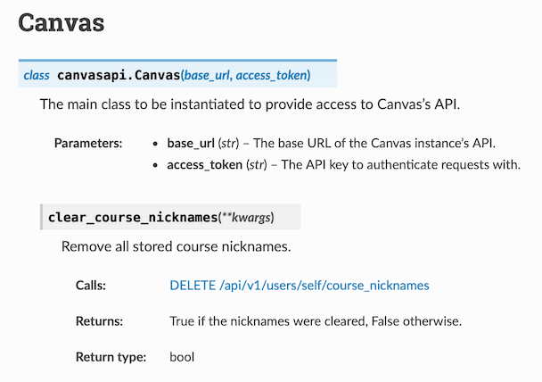
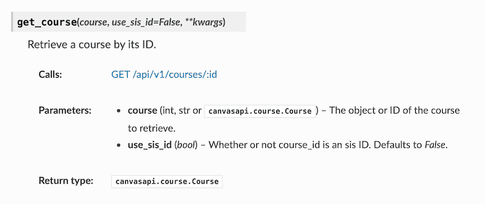
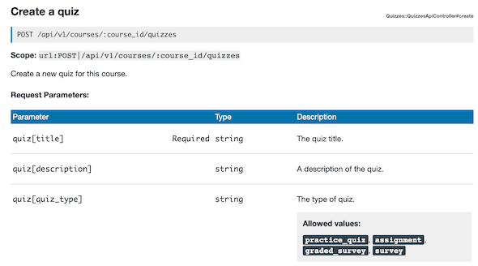
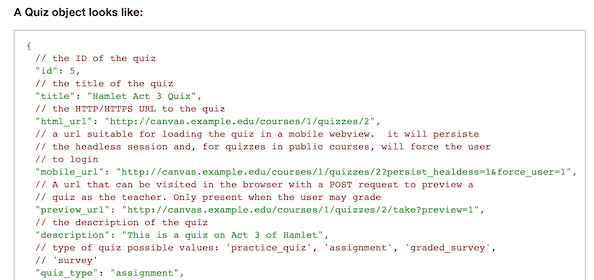

<!-- _class: lead -->
<!-- _class: frontpage -->
<!-- _paginate: skip -->

# Class Reference

<https://canvasapi.readthedocs.io/en/stable/class-reference.html>

---

- Visit canvasapi class reference to understand all the details of the canvasapi classes.
- Each class has the same format:



---

- This example shows the `get_course()` method.
- It explains the inputs and returnt types.
- It also shows what Canvas API is used for this method.



---

## Understanding **kwags

- **kwags means that the method accepts optional keyword arguments (i.e., additional named parameters), but Canvas didn’t explicitly list them in the documentation.
- To find out what keyword arguments are supported, you can use Python.

---

```python
from canvasapi import Canvas
import inspect

print(inspect.getsource(Canvas.clear_course_nicknames))
```

```python
def get_course(self, course, se_sis_id=False, **kwargs):
    """
    Retrieve a course by its ID.
    :calls: `GET /api/v1/courses/:id \
    <https://canvas.instructure.com/doc/api/courses.html#method.courses.show>`_
    :param course: The object or ID of the course to retrieve.
    :type course: int, str or :class:`canvasapi.course.Course`
    :param use_sis_id: Whether or not course_id is an sis ID.
        Defaults to `False`.
    :type use_sis_id: bool
    :rtype: :class:`canvasapi.course.Course`
    """
    if use_sis_id:
        course_id = course
        uri_str = "courses/sis_course_id:{}"
    else:
        course_id = obj_or_id(course, "course", (Course,))
        uri_str = "courses/{}"
    response = self.__requester.request(
        "GET", uri_str.format(course_id), _kwargs=combine_kwargs(**kwargs)
    )
    return Course(self.__requester, response.json())
```

---

- The Python CanvasAPI library is a wrapper around the Canvas REST API.
- So check the official Canvas REST API documentation to see which parameters are allowed.
- You can find the link in the source "<https://canvas.instructure.com/doc/api/courses.html#method.courses.show>"

---

### Usage Example: Quiz class

course.create_quiz generates Quiz object.

```python
class canvasapi.quiz.Quiz(requester, attributes)

class Quiz(CanvasObject):
    def __init__(self, requester, attributes):
        super(Quiz, self).__init__(requester, attributes)

```

---

I need to use create_quiz() method.

```python
canvas = utils.get_canvas()
course = canvas.get_course(81929)
print(inspect.getsource(course.create_quiz))
```

```python
def create_quiz(self, quiz, **kwargs):
    """
    Create a new quiz in this course.
    :calls: `POST /api/v1/courses/:course_id/quizzes \
    <https://canvas.instructure.com/doc/api/quizzes.html#method.quizzes/quizzes_api.create>`_
```

---

Follow the link to find the information & JSON.





---

| Parameter   |          | Type   | Description    |
|-------------|----------|--------|----------------|
| quiz[title] | Required | string | The quiz title |

This description matches this JSON component.

```json
  "title": "Hamlet Act 3 Quiz",
```

---

Using the information, we can make the curl command.

```bash
curl -X POST "https://<your-canvas-domain>/api/v1/courses/<course_id>/quizzes" \
  -H "Authorization: Bearer <YOUR_ACCESS_TOKEN>" \
  -H "Content-Type: application/json" \
  -d '{
        "quiz": {
          "title": "Sample Quiz",
          "description": "This is a sample quiz created via API",
          "time_limit": 30,
          "shuffle_answers": true,
          "hide_results": "always",
          "published": true
        }
      }'
```

The return value is a JSON string:

```json
{"id":337319,
"title":"Sample Quiz",
"html_url":"https://nku.instructure.com/courses/81929/quizzes/337319",
"mobile_url":"https://nku.instructure.com/courses/81929/quizzes/337319?force_user=1\u0026persist_headless=1",
"description":"This is a sample quiz created via API",
"quiz_type":"assignment",
"time_limit":30,
"timer_autosubmit_disabled":false,
"shuffle_answers":true,
"show_correct_answers":true,
"scoring_policy":"keep_highest",
"allowed_attempts":1,
"one_question_at_a_time":false
...
```

---

We can use the same information for the **kwags in the create_quiz method.

```python
new_quiz = course.create_quiz({
    "title": "My First Quiz",
    "description": "This quiz was created via canvasapi.",
    "quiz_type": "assignment",       # other types: 'practice_quiz', 'graded_survey', 'survey'
    "published": False,              # keep unpublished until ready
    "time_limit": 30,                # in minutes
    "allowed_attempts": 2,           # students can attempt twice
    "shuffle_answers": True,
    "points_possible": 10
})
```

The returned quiz object has the information.

```python
print(f"Created quiz: {new_quiz.title} (ID: {new_quiz.id})")
```

---

#### Add questions

We can use other methods to do some actions or get information.

```python
new_question = new_quiz.create_question({
    "question_name": "Simple Math",
    "question_text": "What is 5 + 7?",
    "question_type": "multiple_choice_question",
    "points_possible": 5,
    "answers": [
        {"answer_text": "10", "weight": 0},
        {"answer_text": "11", "weight": 0},
        {"answer_text": "12", "weight": 100},  # correct
        {"answer_text": "13", "weight": 0}
    ]
})

print(f"Added question: {new_question.question_text}")
```

---

### Retrieve & inspect quiz

In many cases, we don't need to use the **kwags option.

```python
quiz = course.get_quiz(new_quiz.id)
print(f"Quiz title: {quiz.title}")
print(f"Due at: {quiz.due_at}")
print(f"Points possible: {quiz.points_possible}")
```

### List all questions

```python
for q in quiz.get_questions():
    print(f"Q{q.id}: {q.question_text}")
```

---

## Requester

We have the requester as the argument.

```python
class Quiz(CanvasObject):
    def __init__(self, requester, attributes):
        super(Quiz, self).__init__(requester, attributes)
```

- It’s not something you provide manually when calling course.create_quiz.
- It is an internal object created by canvasapi when you instantiate Canvas(API_URL, API_KEY).
- Specifically, it’s an instance of canvasapi.requester.Requester.

---

### JSON/Python Attributes

Canvas API responds with something like this.

- This is a Python dictionary.
- This can be interpreted as JSON object.

```json
{
  "id": 42,
  "title": "My First Quiz",
  "description": "This quiz was created via canvasapi.",
  "quiz_type": "assignment",
  ...
}
```

---

#### Python Object -> JSON string (dumps)

```python
import json

# Example Python dictionary
data = {
    "name": "Alice",
    "age": 25,
    "is_student": True
}

# Convert to JSON string
json_str = json.dumps(data)

print(json_str)
# Output: {"name": "Alice", "age": 25, "is_student": true}
```

---

#### JSON string -> Python Object (loads)

```python
# Example JSON string
json_str = '{"name": "Alice", "age": 25, "is_student": true}'

# Convert to Python dictionary
data = json.loads(json_str)

print(data)
# Output: {'name': 'Alice', 'age': 25, 'is_student': True}
```
