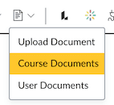
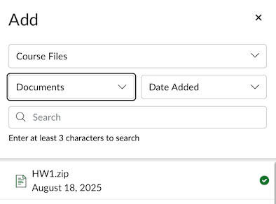
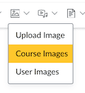
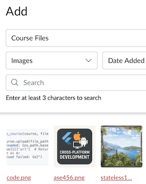
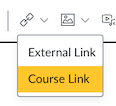
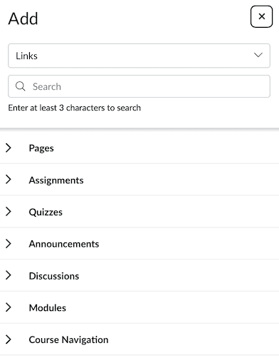

<!-- _class: lead -->
<!-- _class: frontpage -->
<!-- _paginate: skip -->

# Canvas Object ID & Link Generation

---

## File & Image Links

```html
https://nku.instructure.com/courses/COURSE_ID/
files/ID
```

---

### File Links

<style>
.columns {
  display: flex;
  gap: 2rem;
  justify-content: center; /* centers horizontally */
  align-items: center;     /* centers vertically */  
}
.column.text {
  flex: 6;
}
.column.image {
  flex: 4;
}
</style>

  <div class="columns">

  <div class="column">




  </div>
  <div class="column">
  
- We can make a link to any uploaded files.
- In this example, we can add a link to existing file in a page.
  
</div>
</div>

```html
<a id="12708499" class="instructure_file_link inline_disabled" 
title="Link" 
href="https://nku.instructure.com/courses/81929/
files/12708499?wrap=1" 
target="_blank" 
rel="noopener" 
data-api-endpoint="https://nku.instructure.com/api/v1/courses/81929/
files/12708499" 
data-api-returntype="Filе">
  HW1.z¡p
</a>
```

---

- `data-api-endpoint`: The API URL for the file, used for Canvas internal operations like fetching metadata or controlling access.
- `data-api-returntype`: Indicates the expected return type from the API (like “File”).
- `target="_blank"`: Opens the link in a new tab/window.
  - `rel="noopener"`: Security feature to prevent the new page from accessing the window.opener property in a new tab.

---

- `class="instructure_file_link inline_disabled"`: CSS classes for styling and behavior in Canvas UI (the download symbol).
- The `href` with `?wrap=1` makes Canvas open the file wrapped in the page for preview

---

<style scoped>
table { font-size: 15pt !important; line-height: 1.2 !important;}
</style>

| Attribute             | Purpose & Effect                                              | Needed in Autogenerated Links?                                                |
|-----------------------|---------------------------------------------------------------|-------------------------------------------------------------------------------|
| `href`                | URL to the page or file (essential)                           | **Required** — without it, the link won’t work                                |
| `title`               | Tooltip text shown on hover                                   | Optional but recommended for accessibility and clarity                        |
| `class`               | CSS classes that style the link and may add icons/UI features | Optional; add if you want Canvas-like styling (e.g., `instructure_file_link`) |
| `target="_blank"`     | Opens the link in a new tab/window                            | Optional; use if you want to open links in new tabs                           |
| `rel="noopener"`      | Security feature for links with `target="_blank"`             | Recommended whenever using `target="_blank"`                                  |
| `data-api-endpoint`   | Internal Canvas API URL for the resource                      | Usually NOT needed unless you rely on Canvas scripts consuming it             |
| `data-api-returntype` | Metadata for Canvas internal use                              | Usually NOT needed                                                            |
| `data-course-type`    | Indicates type of link (e.g., wikiPages)                      | Optional; mainly for Canvas internal use and UI                               |
| `data-published`      | Indicates if a page is published or not                       | Optional; only for UI display, safe to omit                                   |

---

- This is simpler link that should work.

```html
<a href="https://nku.instructure.com/courses/81929/files/12708499?wrap=1" 
  class="instructure_file_link" 
  target="_blank" 
  rel="noopener" 
  title="HW1.zip">
  HW1.zip
</a>
```

---

### Image Links

<style>
.columns {
  display: flex;
  gap: 2rem;
  justify-content: center; /* centers horizontally */
  align-items: center;     /* centers vertically */  
}
.column.text {
  flex: 6;
}
.column.image {
  flex: 4;
}
</style>

  <div class="columns">

  <div class="column">




  </div>
  <div class="column">
  
- We can access the uploaded page.
- The generated link is similar, but simpler.
  
</div>
</div>

```html

```

---

## Page & Other Links

```html
https://nku.instructure.com/courses/COURSE_ID/
X/ID
```

<style>
.columns {
  display: flex;
  gap: 2rem;
  justify-content: center; /* centers horizontally */
  align-items: center;     /* centers vertically */  
}
.column.text {
  flex: 6;
}
.column.image {
  flex: 4;
}
</style>

  <div class="columns">

  <div class="column image">




  </div>
  <div class="column text">
  
X can be

- pages
- assignments
- quizzes
- announcements
- modules
- ...
  
</div>
</div>

---

### Page Links - pages

```html
<a title="Course Rules" 
href="https://nku.instructure.com/courses/81929/pages/course-rules-2" 
data-course-type="wikiPages" 
data-published="true" 
data-api-endpoint="https://nku.instructure.com/api/v1/courses/81929/pages/course-rules-2" 
data-api-returntype="Page">
  Course Rules
</a>
```

---

```json
{
  "url": "course-rules-2",
  "title": "Course Rules",
  "published": true,
  ...
}
```

- Use the Canvas API endpoint for pages, which returns page details including the `published` status as a boolean field.
- You would map this API field directly to the `data-published` attribute in your generated link.
- However, it is safe not to include `data-published` in your autogenerated link.

---

### Quiz Links - quizzes

```html
<a title="Sample Quiz"
href="https://nku.instructure.com/courses/81929/quizzes/337275"
data-course-type="quizzes"
data-published="false"
data-api-endpoint="https://nku.instructure.com/api/v1/courses/81929/quizzes/337275"
data-api-returntype="Quiz">
  Sample Quiz
</a>
```

<style scoped>
table { font-size: 15pt !important; line-height: 1.2 !important;}
</style>

| Attribute          | Need for Functional Links | Benefits                                         |
|--------------------|---------------------------|--------------------------------------------------|
| `data-course-type` | Optional                  | Enables Canvas-specific UI behaviors and styling |

- It is not strictly required for the link to function.
- The link will work without it because the essential attribute is the `href` pointing to the quiz URL.
