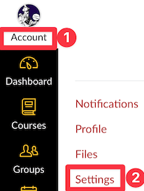
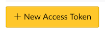
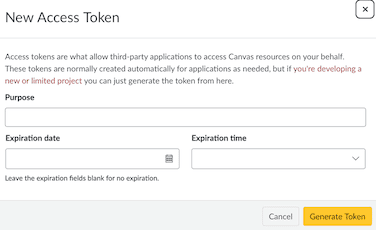

<!-- _class: lead -->
<!-- _class: frontpage -->
<!-- _paginate: skip -->

# Canvas LMS (Learning Management System) API

## simple_examples

---

## Canvas LTI REST APIs (Canvas API)

- Canvas LTI supports a **full set of REST APIs**.
- Using these APIs, we can access **all Canvas features** without relying on the Canvas web app.
- Documentation: <https://developerdocs.instructure.com/services/canvas>

---

### Why Use Canvas API?

- **Automate repetitive tasks** (bulk uploads, grading)
- **Batch operations** (create multiple assignments)
- **Custom integrations** (connect with external tools)
- **Data analysis** (student progress, analytics)
- **Time savings** (especially for large courses)

---

## Getting Your Canvas API Key

### Step 1: Login to Canvas

<div class="columns">
<div class="column">

- Go to your Canvas instance
- Click on **Account** → **Settings**

</div>

<div class="column">



</div>

</div>

---

### Step 2: Generate Token

- Scroll to **Approved Integrations**
- Click **+ New Access Token**
- Enter purpose: "Course Management API"
- **Save the token immediately!** (You can't see it again)

<BR>




---

### Canvas Course Information

#### Course Number

- From the Canvas course URL, identify the **five-digit number**.  
- Example:  
  <https://nku.instructure.com/courses/81921/>  
  → Course Number: **81921**

---

## Storing the Access Token & URL

Make .env file and copy your API_KEY and the API_URL.

```txt
API_URL='https://nku.instructure.com/'
API_KEY='6E8aQFRn7fhZTCGn9ZkXV2w3Xy...RxPxmEQT'
```

---

### 🔒 Keep Your API Key Safe

- **Never commit** API keys to version control
- Use **.env files** (add to .gitignore)
- **Rotate tokens** regularly
- **Limit scope** when possible (permissions and access levels that your API token has)

---

## Installing Python Tools

- **Python UV** is a modern, state-of-the-art tool for Python package management, so we use **UV** in this example and others.  
- If you’re already comfortable with **venv** and **pip**, you can use them also.

---

### Installing UV

```bash
curl -Ls https://astral.sh/uv/install.sh | sh
```

After installation, you may need to add the binary’s path to your `PATH` environment variable if it’s not automatically set.

### Platform-Specific Methods (Mac)

If you have `brew` installed:

```bash
brew install uv
```

---

### Making UV environment and Using UV

- Make sure .env file is in the `simple_examples` directory.
- Open a Terminal (Command Line), and run these commands in the `simple_examples` directory.

```bash
uv init .
uv venv
uv add -r requirements.txt
```

If you use venv/pip, use this command in your venv.

```bash
pip install -r requirements.txt
```

---

### Run check script

```bash
uv run 1_setup_check.py
```

You should see the message:

```txt
🎯 Canvas API Setup Verification
========================================
✅ Environment variables configured
✅ Required packages installed
✅ Connected to Canvas as: Samuel Cho

🎉 Setup complete! You're ready to use the Canvas API
```

---

## Accessing Canvas using Curl

Using the API_KEY & API_URL, we can access any Canvas API with any tools, including Curl.

```bash
source .env &&
curl -s -I -H "Authorization: 
  Bearer $API_KEY" 
  "${API_URL%/}/api/v1/courses?per_page=1" 
| grep -i link: 
| grep -o '[^,]*rel="last"[^,]*' 
| awk -F'page=' '{split($2,a,"&"); print a[1]}'
```

Execute `2_get_total_course_count.sh` to get the number of your courses.

---

## Using CanvasAPI Python Package

- However, accessing Canvas API using REST API is hard to use.
  - We should learn available APIs from developer documents (<https://developerdocs.instructure.com/services/canvas>).
  - We should make a proper request.
  - The response is in the JSON format, so we need to parse the JSON to get the information we need.

---

### CanvasAPI

- We use CanvasAPI.
  - CanvasAPI (<https://github.com/ucfopen/canvasapi>) is a Python library for accessing Instructure’s Canvas LMS API.
  - The library enables developers to programmatically manage Canvas courses, users, gradebooks, and more.

```python
from canvasapi import Canvas
```

---

## Simple Examples

### Getting API_URL and API_KEY

```python
from dotenv import load_dotenv
def get_env_variables():
  load_dotenv()
  api_key = os.getenv('API_KEY')
  api_url = os.getenv('API_URL')
  return api_url, api_key
```

---

### Getting Canvas and Course object

```python
from canvasapi import Canvas

url, key = get_env_variables()
canvas = Canvas(url, key)
course_id = 81929 # Use your ID
course = canvas.get_course(course_id)
print(f"Working with course: {course.name}")
print("=" * 50)
```

- Using API_URL and URL_KEY, we can generate Canvas and Course object.

---

#### Get Your Courses

```python
# Get all courses you teach
courses = canvas.get_courses()
for course in courses:
  if hasattr(course, 'name'):
    print(f"Course: {course.name} (ID: {course.id})")
```

- We get all the courses and process them one by one because courses is the PaginatedList  that lazily loads its elements.

---

### Get specific course

To find your course ID:

1. Go to your course in Canvas
2. Look at the URL: <https://nku.instructure.com/courses/12345>
3. The number after "courses/" is your course ID

```python
course_id = 12345
course = canvas.get_course(course_id)
```

---

### Get Students

```python
# Get all students in a course
students = course.get_users(enrollment_type=['student'])
for student in students:
  print(f"{student.name} - {student.email}")
```

---

## Security Best Practices

### 🔒 Keep Your API Key Safe

- **Never commit** API keys to version control
- Use **.env files** (add to .gitignore)
- **Rotate tokens** regularly
- **Limit scope** when possible (permissions and access levels that your API token has)

---

### 🚦 Rate Limiting

restricting how many API requests you can make in a set time.

- Add delays between bulk operations
- Use batch operations when available
- Monitor API usage

---

```python
import time

def batch_operation(items, operation_func, delay=1):
    results = []
    for i, item in enumerate(items):
        result = safe_api_call(operation_func, item)
        results.append(result)
        
        # Add delay to avoid rate limiting
        if i < len(items) - 1:
            time.sleep(delay)
    
    return results
```

---

### ✅ Validation

- Always validate user inputs
- Check course permissions
- Handle API errors gracefully
- Test with small datasets first

---

### Safe API Calls

```python
def safe_api_call(func, *args, **kwargs):
    try:
        return func(*args, **kwargs)
    except Exception as e:
        print(f"❌ API Error: {e}")
        return None
```
